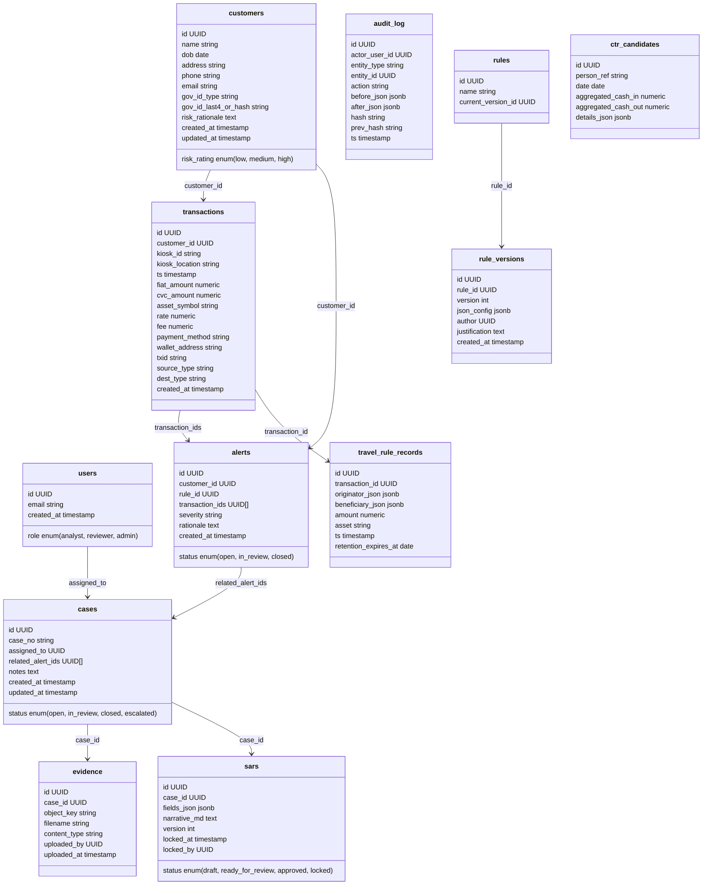

# Database Schema (ERD)

```mermaid
classDiagram
  class users {
    id UUID
    email string
    role enum(analyst, reviewer, admin)
    created_at timestamp
  }
  class customers {
    id UUID
    name string
    dob date
    address string
    phone string
    email string
    gov_id_type string
    gov_id_last4_or_hash string
    risk_rating enum(low, medium, high)
    risk_rationale text
    created_at timestamp
    updated_at timestamp
  }
  class transactions {
    id UUID
    customer_id UUID
    kiosk_id string
    kiosk_location string
    ts timestamp
    fiat_amount numeric
    cvc_amount numeric
    asset_symbol string
    rate numeric
    fee numeric
    payment_method string
    wallet_address string
    txid string
    source_type string
    dest_type string
    created_at timestamp
  }
  class alerts {
    id UUID
    customer_id UUID
    rule_id UUID
    transaction_ids UUID[]
    severity string
    rationale text
    status enum(open, in_review, closed)
    created_at timestamp
  }
  class cases {
    id UUID
    case_no string
    status enum(open, in_review, closed, escalated)
    assigned_to UUID
    related_alert_ids UUID[]
    notes text
    created_at timestamp
    updated_at timestamp
  }
  class evidence {
    id UUID
    case_id UUID
    object_key string
    filename string
    content_type string
    uploaded_by UUID
    uploaded_at timestamp
  }
  class sars {
    id UUID
    case_id UUID
    status enum(draft, ready_for_review, approved, locked)
    fields_json jsonb
    narrative_md text
    version int
    locked_at timestamp
    locked_by UUID
  }
  class audit_log {
    id UUID
    actor_user_id UUID
    entity_type string
    entity_id UUID
    action string
    before_json jsonb
    after_json jsonb
    hash string
    prev_hash string
    ts timestamp
  }
  class rules {
    id UUID
    name string
    current_version_id UUID
  }
  class rule_versions {
    id UUID
    rule_id UUID
    version int
    json_config jsonb
    author UUID
    justification text
    created_at timestamp
  }
  class travel_rule_records {
    id UUID
    transaction_id UUID
    originator_json jsonb
    beneficiary_json jsonb
    amount numeric
    asset string
    ts timestamp
    retention_expires_at date
  }
  class ctr_candidates {
    id UUID
    person_ref string
    date date
    aggregated_cash_in numeric
    aggregated_cash_out numeric
    details_json jsonb
  }

  users --> cases : assigned_to
  customers --> transactions : customer_id
  transactions --> alerts : transaction_ids
  customers --> alerts : customer_id
  alerts --> cases : related_alert_ids
  cases --> evidence : case_id
  cases --> sars : case_id
  rules --> rule_versions : rule_id
  transactions --> travel_rule_records : transaction_id
```
